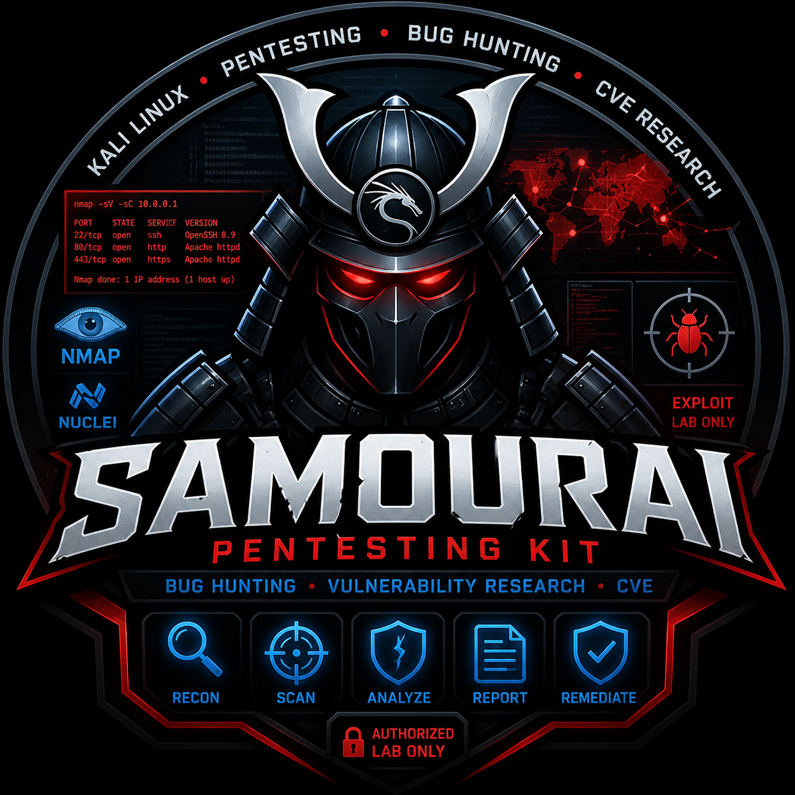

# Samourai Kali — AI Cybersecurity Operating System

<p align="center">
  
</p>

---

# Quick Navigation

- User guide (FR): [docs/guide-utilisateur-fr.md](docs/guide-utilisateur-fr.md)
- User guide (EN): [docs/guide-utilisateur.md](docs/guide-utilisateur.md)
- Templates: [core/templates/README.md](core/templates/README.md)
- Lab setup: [core/governance/conventions/onboarding-existing-project.md](core/governance/conventions/onboarding-existing-project.md)
- Investigation lifecycle: [core/governance/conventions/change-lifecycle.md](core/governance/conventions/change-lifecycle.md)
- Agents & commands: [core/governance/conventions/opencode-agents-and-commands-guide.md](core/governance/conventions/opencode-agents-and-commands-guide.md)

---

# Positioning

Samourai Kali is an **AI Cybersecurity Operating System** that transforms a Kali Linux environment into a structured investigation platform, driven by specialized AI agents.

It provides a comprehensive methodological framework for:
- Bug hunting and vulnerability research
- Vulnerability analysis and CVE research

- Forensic-grade evidence collection
- CVE-ready report generation
- Remediation planning

---

# Problem Statement

AI-assisted vulnerability research suffers from:

- lack of structured methodology
- non-reproducible results
- missing evidence traceability
- unmanaged ethical and legal risks

Samourai Kali delivers:

- A deterministic investigation workflow
- Specialized, orchestrated cyber agents
- Built-in ethical and legal guardrails (LAB-ONLY, NO WEAPONIZATION)
- Standardization via blueprints and reporting templates

---

## Investigation Workflow

```
1. Scoping       → /investigate <target>
2. Recon         → /recon <target> (@attack-surface-agent: nmap, amass, whatweb)
3. Bug Hunting   → /hunt <target> (@bug-hunting-agent: nikto, sqlmap, nuclei, ffuf)
4. Analysis      → /analyze-vuln <vuln-id> (@vulnerability-analysis-agent: burpsuite, semgrep)
5. CVE Research  → /cve-lookup <cve-id> (@cve-intelligence-agent: searchsploit, NVD API)
6. Exploitability → /score <vuln-id> (@exploitability-agent: CVSS, EPSS)
7. Safe POC      → /poc <vuln-id> (@safe-poc-agent: curl, msfconsole, python3)
8. Evidence      → /collect-evidence (@evidence-agent: sha256sum, tcpdump, tshark)
9. CVE Report    → /cve-report <vuln-id> (@cve-report-agent: CVE JSON 5.0)
10. Remediation  → /remediate <vuln-id> (@remediation-agent: nmap, nuclei)
11. Status       → /status (@pm: investigation progress tracking)
```

---

## Cyber Agents

| Agent | Role | Kali Tools |
|-------|------|------------|
| `@attack-surface-agent` | Attack surface mapping | nmap, masscan, amass, subfinder, whatweb, gobuster, nikto |
| `@bug-hunting-agent` | Active vulnerability discovery | sqlmap, nuclei, ffuf, nikto, hydra, semgrep, sslscan |
| `@vulnerability-analysis-agent` | In-depth technical analysis | burpsuite, zaproxy, tcpdump, strace, semgrep |
| `@cve-intelligence-agent` | CVE research and intelligence | searchsploit, NVD API, EPSS API, exploit-db |
| `@exploitability-agent` | CVSS/EPSS scoring | CVSS calculators, EPSS API, ATT&CK |
| `@safe-poc-agent` | Minimal, secure POC | curl, netcat, msfconsole, python3, nmap NSE |
| `@evidence-agent` | Evidence collection | sha256sum, tcpdump, tshark, script, scrot |
| `@cve-report-agent` | CVE-ready report | Writing only (no execution) |
| `@remediation-agent` | Fixes and verification | nmap, nikto, nuclei, sqlmap, semgrep |

### Infrastructure Agents

| Agent | Role |
|-------|------|
| `@pm` | Mission Control — orchestrates the investigation |
| `@architect` | Threat Modeling — STRIDE/DREAD, attack trees |
| `@reviewer` | Peer review of findings and reports |
| `@runner` | Command execution and log capture |
| `@committer` | Conventional Commit commits |
| `@pr-manager` | Report publication |
| `@external-researcher` | Security intelligence via MCP |
| `@editor` | Technical security writing |
| `@fixer` | Debugging and resolution |
| `@toolsmith` | Agent/skill/command creation |

---

## Cyber Skills

| Skill | Capability | Primary Tool |
|-------|------------|--------------|
| `attack-surface-analysis` | Methodical mapping | nmap, amass, whatweb |
| `bug-hunting-analysis` | Structured OWASP hunting | sqlmap, nuclei, ffuf |
| `vulnerability-analysis` | Root cause analysis | burpsuite, semgrep, tcpdump |
| `cve-research` | CVE correlation | searchsploit, NVD API |
| `exploitability-assessment` | CVSS/EPSS scoring | CVSS calculator, EPSS API |
| `safe-poc-generation` | Minimal secure POC | curl, msfconsole, python3 |
| `poc-validation` | Reproducibility validation | tcpdump, sha256sum |
| `evidence-collection` | Forensic-grade evidence | sha256sum, tshark, script |
| `cve-reporting` | CVE JSON 5.0 report | Writing only |
| `remediation-plan` | Remediation plan | nmap, nuclei, semgrep |

---

## Integrated Kali Tools (~50+)

| Category | Tools |
|----------|-------|
| Passive recon | whois, dig, amass, subfinder, theHarvester, wafw00f |
| Active recon | nmap, masscan, whatweb, nikto, gobuster, dirsearch |
| Injection | sqlmap, commix, XSStrike, dalfox |
| Web scanning | nuclei, ffuf, wfuzz |
| Auth/brute | hydra, john, hashcat |
| SAST | semgrep, bandit, trufflehog |
| TLS | sslscan, testssl.sh |
| Dynamic | burpsuite, zaproxy, curl |
| Network | tcpdump, tshark, hping3, netcat |
| Binary | gdb, strace, ltrace, binwalk |
| Exploitation (lab) | msfconsole, msfvenom |
| Forensic | sha256sum, script, scrot |
| Research | searchsploit |

---

## External API Integration

Samourai Kali integrates with security data sources via MCP (Model Context Protocol):

| API | Purpose | Authentication |
|-----|---------|----------------|
| **NVD API** | CVE data retrieval | `NVD_API_KEY` env var (optional) |
| **EPSS API** | Exploit probability scoring | No auth required |

### Configure NVD API (optional)

```bash
# Get your free API key: https://nvd.nist.gov/developers/request-an-api-key
export NVD_API_KEY="your-api-key"

# Add to ~/.bashrc or ~/.zshrc for persistence
echo 'export NVD_API_KEY="your-api-key"' >> ~/.bashrc
```

Commands degrade gracefully when `NVD_API_KEY` is not set.

---

## Blueprints

Blueprints standardize:

- investigation workflows
- vulnerability reports
- POC validation
- security review

Automatically used by:

- `/bootstrap` (lab setup)
- `/write-spec` (vuln specification)
- `/review` (findings review)
- `/pr` (publication)
- `@toolsmith`

---

## Architecture

1. Interaction (human + agents)
2. Orchestration (PM / Mission Control)
3. Specialized cyber agents
4. Skills / Kali Tools
5. Context / Memory / Evidence
6. Governance & Safety Guardrails

---

## Safety Guardrails

Every agent and skill enforces mandatory guardrails:

- **LAB-ONLY**: all exploitation in isolated environments only
- **NO WEAPONIZATION**: minimal POCs, non-weaponizable
- **RESPONSIBLE DISCLOSURE**: responsible disclosure process
- **AUTHORIZATION**: written authorization required before any active testing
- **SCOPE**: never exceed the authorized perimeter
- **DATA PROTECTION**: no exfiltration of sensitive data
- **LOGGING**: all actions logged and timestamped
- **LEGAL COMPLIANCE**: compliance with applicable laws

---

## Quick Install

```bash
curl -fsSL https://raw.githubusercontent.com/FR-PAR-SAMOUR-AI/samourai-kali/main/scripts/install-remote.sh | bash -s -- --target /path/to/project
```

### Local installation

```bash
git clone https://github.com/FR-PAR-SAMOUR-AI/samourai-kali.git
cd samourai-kali
./scripts/install-samourai.sh --target /chemin/vers/mon-lab  # path to your lab
```

### Options

```bash
./scripts/install-samourai.sh --target /chemin/lab --dry-run          # dry run
./scripts/install-samourai.sh --target /chemin/lab --force            # force overwrite
./scripts/install-samourai.sh --target /chemin/lab --editor opencode  # default
./scripts/install-samourai.sh --target /chemin/lab --editor claude    # Claude Code
./scripts/install-samourai.sh --target /chemin/lab --editor cursor    # Cursor
./scripts/install-samourai.sh --target /chemin/lab --editor vscode    # VS Code
./scripts/install-samourai.sh --list-editors                          # list available editors
```

### Supported Editors

- **OpenCode** (default)
- **VS Code**
- **Claude Code**
- **Cursor**

---

## Quick Start (2 min)

1. Install the kit on a Kali Linux environment
2. Open the project in your preferred editor (OpenCode, VS Code, Claude Code, or Cursor)
3. Configure the lab:

```bash
/bootstrap
```

4. Launch an investigation:

```bash
/investigate <target>
```

Or use sub-commands directly:

```bash
/recon <target>      # reconnaissance
/hunt <target>       # vulnerability hunting
/cve-lookup <cve-id> # CVE intelligence
/score <vuln-id>     # exploitability scoring
/poc <vuln-id>       # safe PoC generation
```

5. Or delegate to Mission Control:

```bash
@pm investigate <target>
```

---

## What Changes

Before:
- Ad hoc pentesting
- Unstructured results
- Untraceable evidence
- Manual reports

After:
- Methodical investigation
- Specialized agents per phase
- Forensic-grade evidence chain
- Automated CVE-ready reports
- Built-in ethical guardrails

---

## Governance

- Agent permissions (least-privilege)
- Side-effect control (lab-only)
- Validation before publication
- Full auditability
- Integrated responsible disclosure

---

## Documentation

1. [User guide](docs/guide-utilisateur-fr.md)
2. [Investigation lifecycle](core/governance/conventions/change-lifecycle.md)
3. [Templates](core/templates/README.md)
4. Install then run `/bootstrap`
