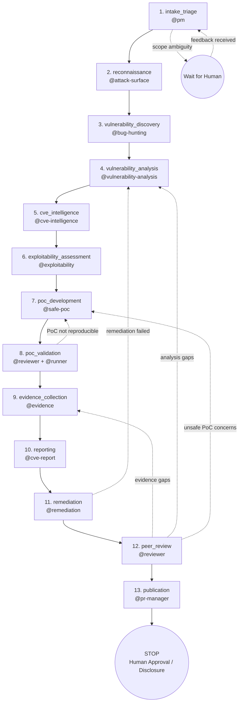

# Investigation Lifecycle

This guide defines the canonical security investigation workflow for this repository. The PM agent (`@pm`) orchestrates the entire lifecycle, delegating to specialized agents at each phase.

## Principles

- One ticket = one investigation.
- The ticket tracker is the source of truth for status.
- Investigation artifacts live under `.samourai/docai/changes/` following the Unified Change Convention.
- Local, ephemeral agent state lives under `.samourai/ai/local/` and is git-ignored.
- `@pm` focuses on one ticket per conversation unless the user explicitly requests a planning-only session.
- Phases can be reopened: if PM discovers incomplete work in a later phase, PM reopens the relevant phase and delegates to the appropriate agent.
- No production interaction is allowed during investigation activities; verification and exploitation work must remain lab-isolated.

## Required Artifacts (per investigation)

Inside the change folder `.samourai/docai/changes/YYYY-MM/YYYY-MM-DD--<workItemRef>--<slug>/`:

| Artifact | Purpose | Mandatory |
|----------|---------|-----------|
| `chg-<workItemRef>-spec.md` | Investigation specification (scope, target, constraints, acceptance criteria) | Yes |
| `chg-<workItemRef>-test-plan.md` | Validation strategy for reproducibility and remediation checks | Yes |
| `chg-<workItemRef>-plan.md` | Phased investigation plan with checklists | Yes |
| `chg-<workItemRef>-pm-notes.yaml` | PM progress tracking, decisions, open questions (git-committed for traceability) | **Yes** |
| `chg-<workItemRef>-recon.*` | Attack-surface reconnaissance outputs | Recommended |
| `chg-<workItemRef>-findings.*` | Raw and curated vulnerability findings | Recommended |
| `chg-<workItemRef>-analysis.*` | Deep technical vulnerability analysis | Recommended |
| `chg-<workItemRef>-cve-intel.*` | CVE/CWE correlation and intelligence notes | Recommended |
| `chg-<workItemRef>-exploitability.*` | CVSS/EPSS scoring rationale and exploitability notes | Recommended |
| `chg-<workItemRef>-report.*` | Disclosure-ready report package | Recommended |
| `chg-<workItemRef>-notes.md` | Free-form notes, experiments, links | No |

## Investigation Phases (PM-controlled)

Phases are ordered and gated. A phase is not complete unless its artifacts exist and are consistent.

**Key**: Phases can be reopened. If PM discovers incomplete work in a later phase (e.g., `peer_review` finds weak evidence), PM reopens the relevant phase and delegates to the appropriate agent.



**Legend**:
- Solid arrows: normal forward flow
- Dashed arrows: feedback loops (phase reopening when gaps are discovered)

### 1) intake_triage

**Owner**: `@pm`

**Goal**: Receive and classify the vulnerability report or target, verify authorization and scope, and ensure all prerequisite context is complete.

**Actions**:

- Read ticket/report from the tracker (via MCP).
- Verify legal/organizational authorization and allowed target scope.
- Classify report type (new finding, regression, duplicate, intel-driven investigation).
- Identify blocking ambiguities and request clarifications from human owner when required.
- Record scope, assumptions, and open questions in `chg-<workItemRef>-pm-notes.yaml`.

**Outcome**: Investigation scope is authorized, classified, and unambiguous.

**Exit criteria**:

- Scope authorization verified.
- Target boundaries documented.
- No unresolved blocking questions.

### 2) reconnaissance

**Owner**: `@pm` delegates to `@attack-surface`

**Goal**: Map the attack surface within authorized scope.

**Actions**:

- `@pm` delegates to `@attack-surface` with `workItemRef`, scope, and constraints.
- `@attack-surface` performs scoped reconnaissance and writes `chg-<workItemRef>-recon.*` outputs.

**Outcome**: A validated asset/entry-point map exists for follow-up investigation.

**Exit criteria**:

- Recon artifacts exist and are traceable.
- Commands and tool outputs are logged.
- No out-of-scope targets were scanned.

### 3) vulnerability_discovery

**Owner**: `@pm` delegates to `@bug-hunting`

**Goal**: Identify potential vulnerabilities and document reproducible findings.

**Actions**:

- `@pm` delegates to `@bug-hunting` using recon outputs.
- `@bug-hunting` performs discovery and writes `chg-<workItemRef>-findings.*`.

**Outcome**: Candidate findings are captured with reproduction hypotheses.

**Exit criteria**:

- Findings artifacts exist.
- Each candidate includes context, trigger conditions, and preliminary impact.

### 4) vulnerability_analysis

**Owner**: `@pm` delegates to `@vulnerability-analysis`

**Goal**: Perform deep technical analysis of discovered vulnerabilities.

**Actions**:

- `@pm` delegates to `@vulnerability-analysis` with findings package.
- `@vulnerability-analysis` validates root cause, exploit path, and impact boundaries in `chg-<workItemRef>-analysis.*`.

**Outcome**: Findings are confirmed/rejected with technical rationale.

**Exit criteria**:

- Root cause documented for each confirmed finding.
- False positives explicitly marked and justified.

### 5) cve_intelligence

**Owner**: `@pm` delegates to `@cve-intelligence`

**Goal**: Correlate findings with known CVEs/CWEs and relevant threat intelligence.

**Actions**:

- `@pm` delegates to `@cve-intelligence` with analysis results.
- `@cve-intelligence` produces `chg-<workItemRef>-cve-intel.*` with correlation notes.

**Outcome**: External vulnerability context is linked and traceable.

**Exit criteria**:

- CVE/CWE mappings documented (or explicit "none found").
- References are attributable and current.

### 6) exploitability_assessment

**Owner**: `@pm` delegates to `@exploitability`

**Goal**: Assess exploitability and risk using CVSS/EPSS and contextual factors.

**Actions**:

- `@pm` delegates to `@exploitability` with analysis + intel.
- `@exploitability` writes `chg-<workItemRef>-exploitability.*` including scoring rationale.

**Outcome**: Risk scoring is complete and defensible.

**Exit criteria**:

- CVSS vector provided with rationale.
- EPSS (or equivalent likelihood signal) documented when available.

### 7) poc_development

**Owner**: `@pm` delegates to `@safe-poc`

**Goal**: Build a safe proof-of-concept in isolated lab conditions.

**Actions**:

- `@pm` delegates to `@safe-poc` with strict safety constraints.
- `@safe-poc` creates PoC artifacts and execution notes.

**Outcome**: A reproducible and controlled PoC exists.

**Exit criteria**:

- PoC runs only in authorized lab scope.
- Safety controls and cleanup steps documented.

### 8) poc_validation

**Owner**: `@pm` delegates to `@reviewer` and `@runner`

**Goal**: Validate reproducibility, determinism, and safety of PoC execution.

**Actions**:

- `@pm` invokes `@reviewer` for protocol and safety review.
- `@pm` invokes `@runner` for reproducibility runs and execution logs.

**Outcome**: PoC is validated as reproducible and safe.

**Exit criteria**:

- Reproduction steps verified by independent rerun.
- No unsafe side effects observed.
- Logs captured and linked.

### 9) evidence_collection

**Owner**: `@pm` delegates to `@evidence`

**Goal**: Build a structured evidence package with integrity metadata.

**Actions**:

- `@pm` delegates to `@evidence` for artifact collection and normalization.
- `@evidence` stores evidence under approved paths and records hashes/timestamps.

**Outcome**: Evidence package is complete, redacted where needed, and integrity-protected.

**Exit criteria**:

- Evidence bundle assembled.
- Hashes/timestamps recorded.
- Sensitive data redaction confirmed.

### 10) reporting

**Owner**: `@pm` delegates to `@cve-report`

**Goal**: Produce a factual, disclosure-ready vulnerability report.

**Actions**:

- `@pm` delegates to `@cve-report` with evidence + analysis package.
- `@cve-report` writes `chg-<workItemRef>-report.*`.

**Outcome**: Report is complete, structured, and suitable for responsible disclosure flow.

**Exit criteria**:

- Report includes summary, impact, reproduction, scoring, and remediation guidance.
- Sensitive details sanitized according to disclosure policy.

### 11) remediation

**Owner**: `@pm` delegates to `@remediation`

**Goal**: Define and validate remediation recommendations.

**Actions**:

- `@pm` delegates to `@remediation` to produce fix recommendations and validation notes.
- `@remediation` validates that proposed fixes mitigate the confirmed exploit path.

**Outcome**: Actionable remediation plan exists and is technically validated.

**Exit criteria**:

- Remediation steps documented.
- Mitigation effectiveness validated in lab.

### 12) peer_review

**Owner**: `@pm` delegates to `@reviewer`

**Goal**: Run final quality gate on findings, evidence, scoring, and report quality.

**Actions**:

- `@pm` invokes `@reviewer` with full investigation package.
- `@reviewer` checks finding accuracy, PoC safety, evidence integrity, CVSS/EPSS correctness, and report completeness.
- If reviewer returns `Status=FAIL`, reopen required phases and re-run review until `Status=PASS`.

**Outcome**: Investigation package is validated and publication-ready.

**Exit criteria**:

- `@reviewer` returns `Status=PASS`.
- No open major findings remain.

### 13) publication

**Owner**: `@pm` delegates to `@pr-manager`

**Goal**: Publish disclosure artifacts and hand off for human approval/disclosure actions.

**Actions**:

- `@pm` invokes `@pr-manager` to create/update publication PR or disclosure bundle.
- `@pm` assigns ticket to human security owner for final disclosure decision.
- **STOP**: Do not start another ticket automatically.

**Outcome**: Disclosure package is ready for human-controlled publication.

**Exit criteria**:

- Publication artifact exists and is up to date.
- Ticket assigned to human security owner.

---

## Phase Reopening

Phases are not strictly linear. If PM discovers incomplete work in a later phase, PM can reopen an earlier phase:

| Discovery in... | Gap found | Action |
|-----------------|-----------|--------|
| `peer_review` | Evidence metadata incomplete | Reopen `evidence_collection`, delegate to `@evidence` |
| `peer_review` | Scoring inconsistency | Reopen `exploitability_assessment`, delegate to `@exploitability` |
| `poc_validation` | PoC unsafe or non-reproducible | Reopen `poc_development`, delegate to `@safe-poc` |
| `remediation` | Fix does not mitigate root cause | Reopen `vulnerability_analysis`, delegate to `@vulnerability-analysis` |
| `publication` | Sensitive detail leakage risk | Reopen `reporting`, delegate to `@cve-report` |

After addressing the gap, PM continues from the reopened phase through the remaining phases.

---

## PM Notes Structure (`chg-<workItemRef>-pm-notes.yaml`)

The PM notes file is **mandatory** for every investigation. It serves as:
- PM's long-term memory for the investigation
- Status tracking across sessions
- Traceability via git history

```yaml
change_id: GH-5
title: "Investigate potential command injection in import pipeline"
classification: "web-app / injection"
authorized_scope:
  targets: ["lab-api.internal"]
  environments: ["isolated-lab"]
  approved_by: "security-owner"
phases:
  intake_triage: { started: "2026-02-02T10:00:00Z", completed: "2026-02-02T10:30:00Z" }
  reconnaissance: { started: "2026-02-02T10:30:00Z", completed: null }
  vulnerability_discovery: { started: null, completed: null }
  vulnerability_analysis: { started: null, completed: null }
  cve_intelligence: { started: null, completed: null }
  exploitability_assessment: { started: null, completed: null }
  poc_development: { started: null, completed: null }
  poc_validation: { started: null, completed: null }
  evidence_collection: { started: null, completed: null }
  reporting: { started: null, completed: null }
  remediation: { started: null, completed: null }
  peer_review: { started: null, completed: null }
  publication: { started: null, completed: null, url: null }
decisions: []
open_questions: []
blockers: []
notes: [] # { text, type, date }
```

---

## Agent Responsibilities Summary

| Phase | Primary Agent | Supporting Agents |
|-------|---------------|-------------------|
| 1. intake_triage | `@pm` | — |
| 2. reconnaissance | `@attack-surface` | `@runner` |
| 3. vulnerability_discovery | `@bug-hunting` | `@runner` |
| 4. vulnerability_analysis | `@vulnerability-analysis` | — |
| 5. cve_intelligence | `@cve-intelligence` | — |
| 6. exploitability_assessment | `@exploitability` | — |
| 7. poc_development | `@safe-poc` | `@runner` |
| 8. poc_validation | `@reviewer` | `@runner` |
| 9. evidence_collection | `@evidence` | `@runner` |
| 10. reporting | `@cve-report` | `@editor` |
| 11. remediation | `@remediation` | `@fixer`, `@runner` |
| 12. peer_review | `@reviewer` | — |
| 13. publication | `@pr-manager` | `@pm` |

---

## Issue Tracker Communication Policy

Use comments as a durable security knowledge base. Comment when it adds durable value:

- Scope authorization and constraints
- Findings and severity decisions (with rationale)
- CVE/CWE/CVSS updates
- Blockers, disclosure constraints, and approval outcomes

Avoid generic status updates. Use tracker state/labels for status.
