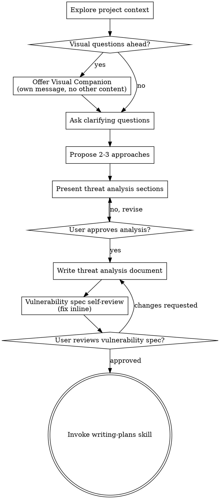

# Threat Brainstorming

Help turn investigation ideas into a threat analysis document through focused collaborative dialogue.

Start by understanding the current project context, then ask questions one at a time to refine the investigation. Once you understand what will be investigated, present the threat analysis and get user approval.

<HARD-GATE>
Do NOT invoke any investigation-execution skill, run scanning/exploitation commands, scaffold POC code, or take any investigation execution action until you have presented analysis and the user has approved it. This applies to EVERY investigation regardless of perceived simplicity.
</HARD-GATE>

## Anti-Pattern: "This Is Too Simple To Need Threat Analysis"

Every investigation goes through this process. A suspicious endpoint, one misconfiguration, one weak control — all of them. "Simple" investigations are where unexamined assumptions cause false positives and wasted effort. The analysis can be short (a few sentences for truly simple findings), but you MUST present it and get approval.

## Checklist

You MUST create a task for each of these items and complete them in order:

1. **Explore project context** — check files, docs, recent commits
2. **Offer visual companion** (if topic will involve visual questions) — this is its own message, not combined with a clarifying question. See the Visual Companion section below.
3. **Ask clarifying questions** — one at a time, understand assets, threat model constraints, and success criteria
4. **Propose 2-3 approaches** — with trade-offs and your recommendation
5. **Present threat analysis** — in sections scaled to complexity, get user approval after each section
6. **Write threat analysis document** — save to `.samourai/docai/changes/YYYY-MM/YYYY-MM-DD--<workItemRef>--<slug>/chg-<workItemRef>-spec.md` and commit
7. **Vulnerability spec self-review** — quick inline check for placeholders, contradictions, ambiguity, scope (see below)
8. **User reviews written vulnerability spec** — ask user to review the file before proceeding
9. **Transition to planning** — invoke writing-plans skill to create investigation plan

## Process Flow

**The terminal state is invoking writing-plans.** Do NOT invoke implementation or execution skills. The ONLY skill you invoke after brainstorming is writing-plans.

## The Process

**Understanding the idea:**

- Check out the current project state first (files, docs, recent commits)
- Before asking detailed questions, assess scope: if the request describes multiple independent threat domains (e.g., API auth, cloud IAM, CI/CD secrets, and client-side exposure), flag this immediately. Don't spend questions refining details of an investigation that needs decomposition first.
- If the scope is too large for a single vulnerability spec, help the user decompose into sub-investigations: what are the independent surfaces, how do they relate, what order should they be analyzed? Then brainstorm the first sub-investigation through the normal flow. Each sub-investigation gets its own vulnerability spec → investigation plan → investigation execution cycle.
- For appropriately-scoped investigations, ask questions one at a time to refine the approach
- Prefer multiple choice questions when possible, but open-ended is fine too
- Only one question per message - if a topic needs more exploration, break it into multiple questions
- Focus on understanding: asset criticality, attacker capabilities, constraints, and success criteria

**Exploring approaches:**

- Propose 2-3 different approaches with trade-offs
- Present options conversationally with your recommendation and reasoning
- Lead with your recommended option and explain why

**Presenting the threat analysis:**

- Once you believe you understand what you're investigating, present the analysis
- Scale each section to its complexity: a few sentences if straightforward, up to 200-300 words if nuanced
- Ask after each section whether it looks right so far
- Cover: attack surface, trust boundaries, threat vectors, exploitation assumptions, and validation strategy
- Be ready to go back and clarify if something doesn't make sense

**Analysis for isolation and clarity:**

- Break the target into smaller investigation units with clear boundaries and assumptions.
- For each unit, answer: what is exposed, who can reach it, what controls exist, and what would constitute proof.
- Can someone understand the risk without inspecting every internal detail? If not, boundaries need work.
- Smaller, well-bounded units reduce false positives and make evidence easier to validate.

**Working in existing codebases and environments:**

- Explore current architecture and deployment context before proposing investigation activity. Follow existing operational constraints.
- Where existing configuration/code creates risk concentration (unclear boundaries, broad trust zones, excessive privileges), include targeted analysis points in the threat analysis.
- Don't propose unrelated hardening work in this stage. Stay focused on what serves the current investigation goal.

## After the Analysis

**Documentation:**

- Write the validated threat analysis (vulnerability spec) to `.samourai/docai/changes/YYYY-MM/YYYY-MM-DD--<workItemRef>--<slug>/chg-<workItemRef>-spec.md`
  - (User preferences for location override this default)
- Commit the threat analysis document to git

**Vulnerability Spec Self-Review:**
After writing the threat analysis document, look at it with fresh eyes:

1. **Placeholder scan:** Any "TBD", "TODO", incomplete sections, or vague requirements? Fix them.
2. **Internal consistency:** Do any sections contradict each other? Do threat vectors align with attack surface and assumptions?
3. **Scope check:** Is this focused enough for a single investigation plan, or does it need decomposition?
4. **Ambiguity check:** Could any requirement be interpreted two different ways? If so, pick one and make it explicit.

Fix any issues inline. No need to re-review — just fix and move on.

**User Review Gate:**
After the review loop passes, ask the user to review the written vulnerability spec before proceeding:

> "Threat analysis document written and committed to `<path>`. Please review it and let me know if you want to make any changes before we start writing out the investigation plan."

Wait for the user's response. If they request changes, make them and re-run the spec review loop. Only proceed once the user approves.

**Investigation planning transition:**

- Invoke the writing-plans skill to create a detailed investigation plan
- Do NOT invoke any other skill. writing-plans is the next step.

## Key Principles

- **One question at a time** - Don't overwhelm with multiple questions
- **Multiple choice preferred** - Easier to answer than open-ended when possible
- **YAGNI ruthlessly** - Remove unnecessary investigation branches
- **Explore alternatives** - Always propose 2-3 approaches before settling
- **Incremental validation** - Present analysis, get approval before moving on
- **Be flexible** - Go back and clarify when something doesn't make sense

## Visual Companion

A browser-based companion for showing mockups, diagrams, and visual options during brainstorming. Available as a tool — not a mode. Accepting the companion means it's available for questions that benefit from visual treatment; it does NOT mean every question goes through the browser.

**Offering the companion:** When you anticipate that upcoming questions will involve visual content (mockups, layouts, diagrams), offer it once for consent:
> "Some of what we're working on might be easier to explain if I can show it to you in a web browser. I can put together mockups, diagrams, comparisons, and other visuals as we go. This feature is still new and can be token-intensive. Want to try it? (Requires opening a local URL)"

**This offer MUST be its own message.** Do not combine it with clarifying questions, context summaries, or any other content. The message should contain ONLY the offer above and nothing else. Wait for the user's response before continuing. If they decline, proceed with text-only brainstorming.

**Per-question decision:** Even after the user accepts, decide FOR EACH QUESTION whether to use the browser or the terminal. The test: **would the user understand this better by seeing it than reading it?**

- **Use the browser** for content that IS visual — mockups, wireframes, layout comparisons, architecture diagrams, side-by-side visual designs
- **Use the terminal** for content that is text — requirements questions, conceptual choices, tradeoff lists, A/B/C/D text options, scope decisions

A question about a UI topic is not automatically a visual question. "What does personality mean in this context?" is a conceptual question — use the terminal. "Which wizard layout works better?" is a visual question — use the browser.

If they agree to the companion, proceed with the per-question decision rules above and keep visuals scoped to threat modeling clarity.
