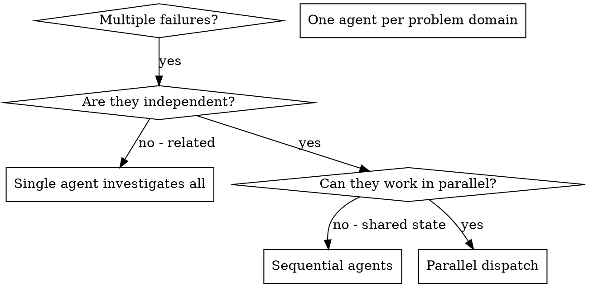

# Dispatching Parallel Agents

## Overview

You delegate tasks to specialized agents with isolated context. By precisely crafting their instructions and context, you ensure they stay focused and succeed at their task. They should never inherit your session's context or history — you construct exactly what they need. This also preserves your own context for coordination work.

When you have multiple unrelated security findings (different targets, different services, different vectors), investigating them sequentially wastes time. Each investigation is independent and can happen in parallel.

**Core principle:** Dispatch one agent per independent problem domain. Let them work concurrently.

## When to Use



**Use when:**
- 3+ hosts/endpoints show different suspicious behavior with different root causes
- Multiple attack surfaces can be analyzed independently
- Each investigation can be understood without context from others
- No shared state between investigations

**Don't use when:**
- Failures are related (fix one might fix others)
- Need to understand full system state
- Agents would interfere with each other

## The Pattern

### 1. Identify Independent Domains

Group failures by what's broken:

- Target A: Exposed SSH/HTTP services requiring service fingerprinting
- Target B: External subdomain space requiring asset discovery
- Target C: Web API behavior requiring injection analysis

Each domain is independent - recon on one target does not block analysis on another.

### 2. Create Focused Agent Tasks

Each agent gets:
- **Specific scope:** One target, endpoint family, or evidence stream
- **Clear goal:** Confirm/deny a specific security hypothesis
- **Constraints:** Stay within authorized scope; no off-scope actions
- **Expected output:** Summary of findings and collected evidence

### 3. Dispatch in Parallel

```typescript
// In Claude Code / AI environment
Task("Run nmap TCP/UDP recon on target A and summarize exposed services")
Task("Run amass enum for target B and produce deduplicated subdomain list")
Task("Run nuclei baseline scan on target C web endpoints and classify findings")
// All three run concurrently
```

### 4. Review and Integrate

When agents return:
- Read each summary
- Verify findings/evidence don't conflict
- Run targeted validation commands for each finding
- Integrate all evidence into the consolidated report

## Agent Prompt Structure

Good agent prompts are:
1. **Focused** - One clear problem domain
2. **Self-contained** - All context needed to understand the problem
3. **Specific about output** - What should the agent return?

```markdown
Investigate potential SQL injection on /api/search in the authorized lab target:

Observed behavior:
1. Single quote (`'`) triggers 500 response intermittently
2. Time-based payload appears to delay responses on some parameters
3. Input normalization may differ between query and JSON body modes

Your task:

1. Reproduce behavior with controlled baseline requests
2. Identify root cause - true injection path, WAF behavior, or false positive
3. Validate with focused sqlmap/manual payloads and capture proof
   - Use minimally invasive payloads first
   - Keep all requests in authorized scope
   - Record request/response evidence with timestamps

Do NOT assume vulnerability based on one anomalous response.

Return: Summary of what you confirmed/disproved and where evidence is stored.
```

## Common Mistakes

**❌ Too broad:** "Test everything" - agent gets lost
**✅ Specific:** "Enumerate subdomains for target B only" - focused scope

**❌ No context:** "Check for SQLi" - agent doesn't know where/how
**✅ Context:** Provide endpoint, parameters, baseline behavior, and scope limits

**❌ No constraints:** Agent may perform off-scope or noisy actions
**✅ Constraints:** "Authorized lab scope only; no destructive payloads"

**❌ Vague output:** "Investigate it" - no usable handoff
**✅ Specific:** "Return confirmed findings + evidence artifact paths"

## When NOT to Use

**Related failures:** Fixing one might fix others - investigate together first
**Need full context:** Understanding requires seeing entire system
**Exploratory debugging:** You don't know what's broken yet
**Shared state:** Agents would interfere (editing same files, using same resources)

## Real Example from Session

**Scenario:** Multiple parallel security tasks across independent targets

**Investigations:**
- Target A: Port/service exposure mapping
- Target B: Subdomain enumeration and takeover checks
- Target C: Web endpoint vulnerability scanning

**Decision:** Independent domains - host recon, asset discovery, and web scanning can run concurrently

**Dispatch:**
```
Agent 1 → Run nmap recon on target A
Agent 2 → Run amass enumeration on target B
Agent 3 → Run sqlmap/nuclei checks on target C endpoints
```

**Results:**
- Agent 1: Identified exposed admin interface on non-standard port
- Agent 2: Produced validated subdomain inventory with takeover candidates flagged
- Agent 3: Confirmed one injectable parameter and ruled out two false positives

**Integration:** Findings independent, no operational conflicts, evidence merged into final report

**Time saved:** 3 investigations completed in parallel vs sequentially

## Key Benefits

1. **Parallelization** - Multiple investigations happen simultaneously
2. **Focus** - Each agent has narrow scope, less context to track
3. **Independence** - Agents don't interfere with each other
4. **Speed** - 3 problems solved in time of 1

## Verification

After agents return:
1. **Review each summary** - Understand what changed
2. **Check for conflicts** - Did agents test overlapping assets or duplicate evidence?
3. **Run validation set** - Verify all findings/evidence hold together
4. **Spot check** - Agents can make systematic errors

## Real-World Impact

From parallel security assessment session:
- 3 independent targets/surfaces investigated
- 3 agents dispatched in parallel
- All investigations completed concurrently
- All findings integrated successfully
- Zero conflicts between agent workstreams
