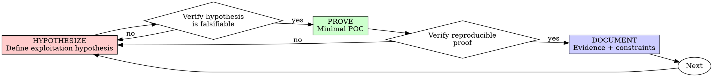

# Proof-Driven Analysis

## Overview

State the exploitation hypothesis first. Try to prove it with a minimal POC. Capture evidence.

**Core principle:** If you didn't reproduce proof from a clear hypothesis, you don't know if the claim is valid.

**Violating the letter of the rules is violating the spirit of analysis.**

## When to Use

**Always:**
- New vulnerability claims
- Security bug investigations
- Severity re-assessments
- Behavior change claims with security impact

**Exceptions (ask your human partner):**
- Throwaway local exploration that will not be reported
- Non-security refactors

Thinking "skip proof just this once"? Stop. That's rationalization.

## The Iron Law

```
NO VULNERABILITY CLAIM WITHOUT REPRODUCIBLE PROOF FIRST
```

Write a claim before proof? Delete it. Start over.

**No exceptions:**
- Don't keep unsupported claim text as "reference"
- Don't backfill proof after publishing severity
- Don't rely on one-off screenshots

## Hypothesize-Prove-Document



### HYPOTHESIZE

Write one minimal, falsifiable exploitation hypothesis.

**Requirements:**
- One behavior path
- Clear preconditions and attacker model
- Explicit expected security impact

### PROVE

Build the smallest safe POC to test that hypothesis.

**MANDATORY validation:**
- Reproduce in controlled conditions
- Failures are informative (not tooling noise)
- Result supports or disproves hypothesis

### DOCUMENT

Capture:
- Exact reproduction steps
- Evidence artifacts (requests, responses, logs, traces)
- Limitations and required conditions
- Severity rationale (if applicable)

Don't add extra claims beyond what proof supports.

## Why Order Matters

"I'll write proof after I report" breaks rigor:
- Claims become anchored to assumptions
- Evidence gets shaped to confirm narrative
- Reproducibility and peer review quality drop

Hypothesis-first and proof-first prevent confirmation bias.

## Common Rationalizations

| Excuse | Reality |
|--------|---------|
| "It's obvious" | Obvious findings still need reproducible proof. |
| "I'll prove it later" | Later proof often fails and damages credibility. |
| "One screenshot is enough" | Screenshots are not reproducible proof. |
| "I tested manually once" | One-off manual success is not reliable evidence. |
| "Already spent hours, can't restart" | Sunk cost doesn't validate unsupported claims. |

## Red Flags - STOP and Start Over

- Finding reported before reproducible proof
- POC without explicit hypothesis
- Untested assumptions in severity statements
- Evidence missing control case
- "Just this once" rationalization

**All of these mean: remove unsupported claim and restart with hypothesis → POC → evidence.**

## Verification Checklist

Before marking finding complete:

- [ ] Hypothesis is explicit and falsifiable
- [ ] Minimal POC exists
- [ ] Proof is reproducible
- [ ] Evidence artifacts are preserved
- [ ] Limitations and constraints documented
- [ ] Severity (if any) tied to demonstrated impact

Can't check all boxes? Don't claim vulnerability yet.
